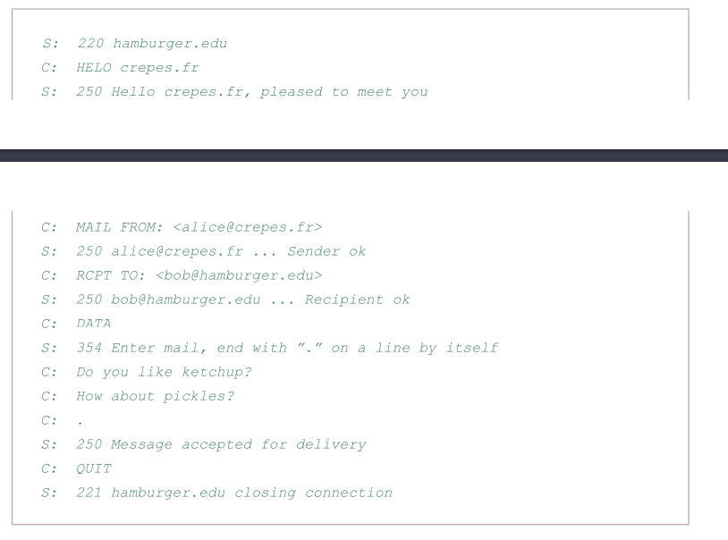

## جزئیات پیاده‌سازی کلاینت SMTP با زبان گولنگ

اعضای تیم:

+ روزبه شریف‌نسب 97243093
+ شهریار مربی 97243064

برای پیاده‌سازی کلاینت SMTP ابتدا لازم بود به خود پروتکل (در حد نیاز) مسلط شویم، بنابراین چند مثال و مثال خود کتاب مطالعه و بررسی گردید.

همچنین از لینک‌های زیر کمک گرفته شد:

+ about SMTP authentication [+](https://www.ndchost.com/wiki/mail/test-smtp-auth-telnet)
+ SMTP send mail explained [+](https://www.ndchost.com/wiki/mail/test-smtp-auth-telnet)
+ gmail less secure apps [+](https://support.google.com/accounts/answer/6010255?p=less-secure-apps&hl=en&visit_id=637528055941711149-3770501630&rd=1)

در مرحله بعدی، کاری که انجام شد تست کردن ارسال ایمیل با telnet برای آزمون آموخته‌ها بود. سرور smtp.google.com و پورت ۲۵ انتخاب شد و درخواست‌ها یکی یکی فرستاده شد. همه چیز خوب بود فقط مشکلی که وجود داشت احراز هویت بود. طبیعتا سرور به هویت فرستنده نیاز داشت اما AUTH LOGIN به شکل متن ساده را قبول نمی‌کرد. باید از STARTTLS استفاده می‌شود ولی در telnet میسر نبود.

فلذا از دستور openssl به جای telnet استفاده شد، این دستور می‌تواند کانکشن امن ایجاد کند و ارسال ایمیل میسر شود. همچنین در این مرحله که اولین ارسال ایمیل موفقیت‌آمیز رخ داد، یک جیمیل مخصوص اینکار ساخته شد و قابلیت less secure apps روی آن فعال شد تا امنیت ایمیل‌های شخصی اعضای گروه به خطر نیفتد.

پیاده‌سازی در زبان برنامه‌نویسی هم چیز متفاوتی از ارسال با همین openssl نداشت، یک کانکشن امن tls با پورت ۴۶۵ سرور باز شد. یک روتین (هم‌روند) برای گرفتن اطلاعات از سوکت و چاپ آن‌ها استفاده شد، کار این روتین این بود که مداوم روی سوکت گوش می‌کرد و به محض دریافت خط جدیدی از داده، آن را چاپ می‌کرد. همچنین زمان و اینکه این اطلاعات از سرور آمده را هم مشخص می‌کند.

در ترد اصلی هم به ارسال اطلاعات ایمیل می‌پردازیم. ابتدا اطلاعات فرستنده و گیرنده و محتوای ایمیل از طریق commandline argument دریافت می‌شوند. سپس اولین handshake (بعد از باز کردن سوکت) با عبارت EHLO server ارسال می‌شود. سپس به ترتیب عملیات احراز هویت و ارسال ایمیل انجام می‌شود.

## عملیات احراز هویت 

برای این برنامه از احراز هویت ساده با دستور `AUTH LOGIN‍` استفاده کردیم. یوزرنیم و پسورد در خطوطی جداگانه و encode شده با base64 ارسال شدند. روشهای دیگری برای ارسال یوزرنیم و پسورد قابل انجام بود مثلا هردو را با یک \0 میانشان base64 کنیم ولی روش ما به نظر ساده‌تر و سرراست تر است.

## عملیات ارسال ایمیل 

اکنون که احراز هویت صورت گرفته با دستور ‍`MAIL FROM:` می‌توانیم ارسال ایمیل را شروع کنیم. در اینجا آدرس ایمیل مبدا (همان که آن را در مرحله قبل احراز هویت کردیم) را ارسال می‌کنیم. سپس ایمیل مقصد و کلیدواژه DATA

با نوشتن کلیدواژه DATA یعنی محتوای ایمیل را می‌فرستیم. ابتدا subject: و سپس بدنه ایمیل و نهایتا یک `.` در یک خط خالی که به معنای اتمام بدنه است. در صورتی  که ایمیل ما attachment داشته باشد هم باید ان را base64 شده در همین بدنه ارسال کنیم ولی موضوع این تکلیف نبود. همچنین شایان ذکر است که فقط ایمیل مبدا gmail مورد پذیرش برنامه است چرا که ما روی سرور smtp گوگل با آدرس smtp.google.com کار کردیم.

پس از ارسال ایمیل می‌توان از همان کانکشن ایمیل‌های دیگری هم فرستاد ولی ما فقط یک ایمیل می‌خواهیم بفرستیم پس عبارت `QUIT`	 وارد می‌شود و کانکشن بسته می‌شود.

در ادامه چند اسکرین‌شات از اجرای برنامه و ارسال ایمیل نیز قرار داده می‌شود:

+ ابتدا یوزرنیم و پسورد به صورت هارد‌کد بودند و اینجا اولین ایمیل به ایمیل یکی از اعضای گروه ارسال شد.

+ سپس قابلیت commandline argument اضافه شد و اطلاعات از کاربر ورودی گرفته می شود.

+ در نهایت یک ایمیل با کامل کردن cli argument ها ارسال شد.

